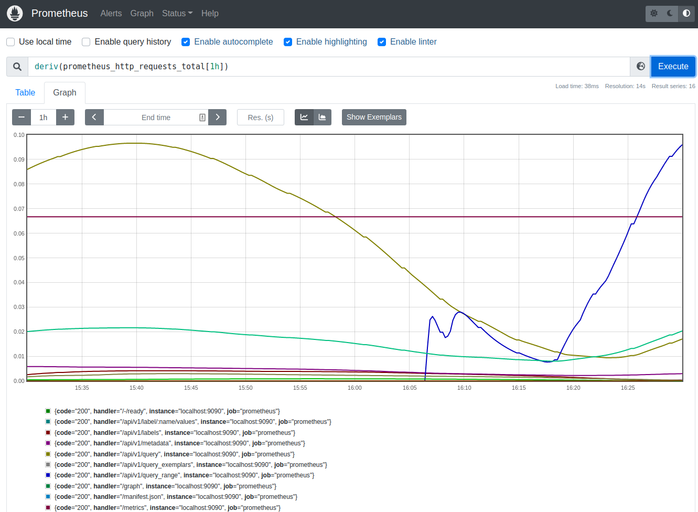
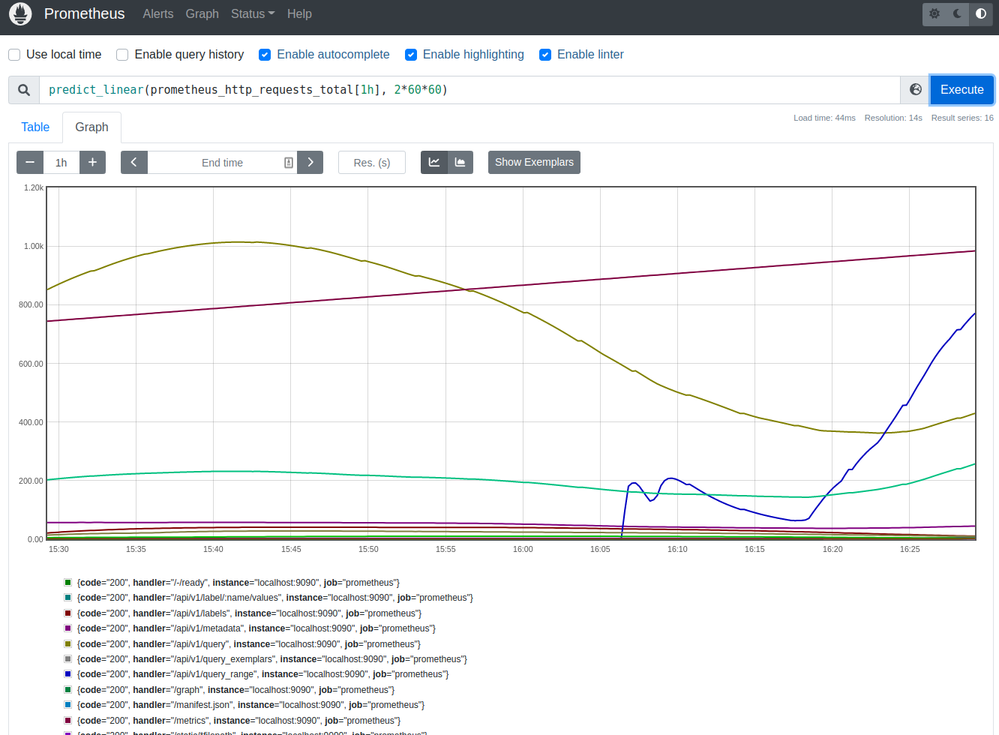
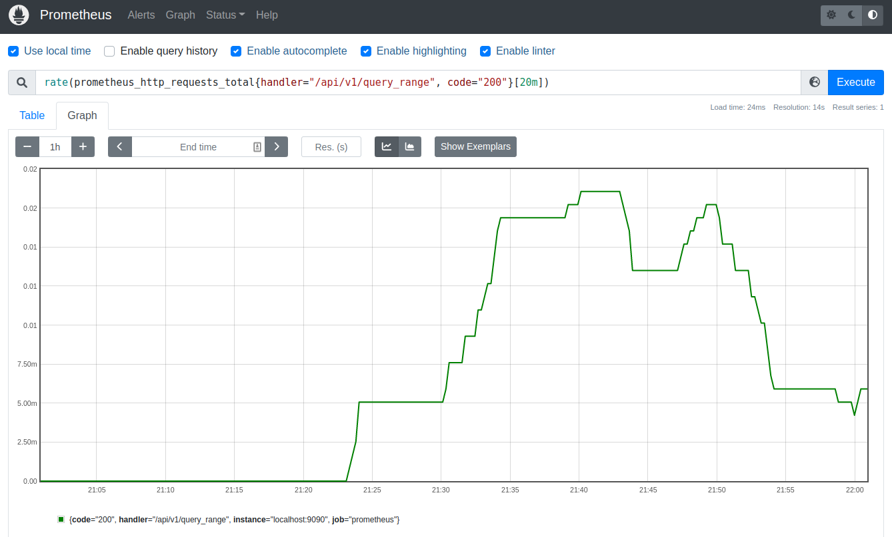
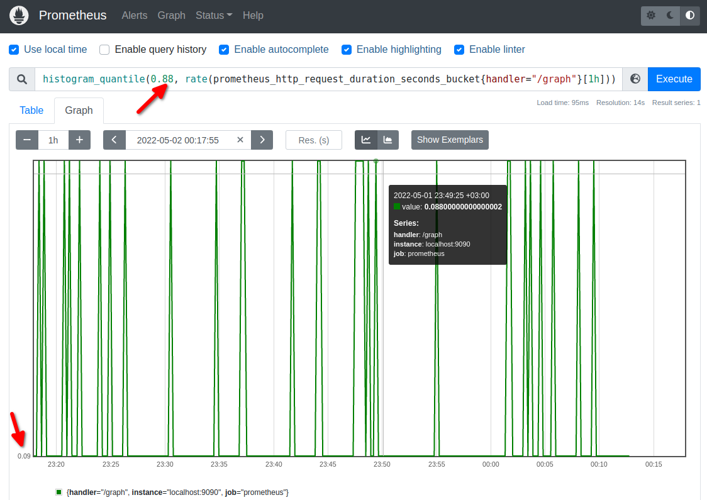
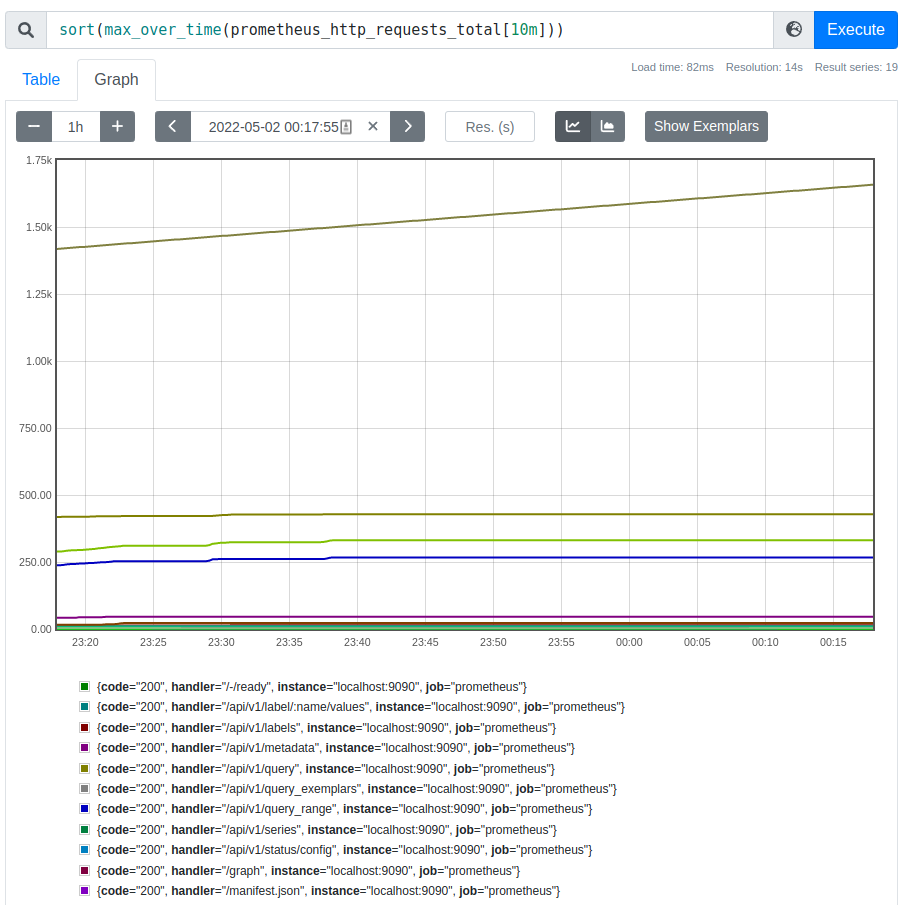

# Prometheus PromQL Kullanımı

- [Prometheus'a Giriş](1.prometheus-nedir.md)
- [Prometheus Instrumentation ve Node Exporter Kullanımı](2.instrumentation.md)
- [PromQL Kullanımı](3.quering.md)
- [Prometheus Kural Tanımlama](4.configuring_rules.md)
- [Prometheus Alertmanager Kullanımı](5.alertmanager.md)
- [Prometheus Blackbox Exporter Kullanımı](6.blackbox_exporter.md)
- [Prometheus Pushgateway Exporter Kullanımı](7.pushgateway.md)
- [Prometheus Service Discovery](8.service_discovery.md)
- [Prometheus Grafana Entegrasyonu](9.grafana_integration.md)

Prometheus fonksiyonel bir dil olan PromQL dilini (Prometheus Query Language) kullanır. Sorgu sonuçları tablo veya grafik olarak alınabileceği gibi http api üzerinden de farklı dış sistemlere taşınabilir.

## Veri Tipleri

Dört adet veri tipi vardır.

- **Instant vector** : Herhangi bir anda o an için kaynak alınan zamansal seri (time series) verisidir. Örneğin graph ekranında _node_cpu_seconds_total_ yazıp execute etiğimizde o an için Prometheus'un bize verdiği örneğin 6-7 satırlık veri (vector) bir instant vector'dür.  
- **Range vector**: Belirli zaman aralığında toplanan zaman serisi verilerini ifade eder. Örneğin graph ekranında _node_cpu_seconds_total[1m]_ yazıp execute etiğimizde 1 dakika içinde ilgili metriklerin her birinden kaç adet veri toplandıysa hepsini görebiliriz.  
- **Scalar**: Basit noktalı sayıdır (örn. 12.34)
- **String**: Metinsel ifadelerdir. Çok fazla kullanılmaz.

Daha detaylı bilgi almak isterseniz [resmi dokümanlarını](https://prometheus.io/docs/prometheus/latest/querying/basics/) inceleyebilirsiniz.

## Metrik Tipleri

- **Counter**: sıfırdan başlayarak yukarı doğru artan rakamlardır. Örneğin kullanıcı sayısı, tamamlanan görev sayısı vb.
- **Gauge**: Yukarı ve aşağı doğru atrıp azalabilen değerlerdir. Örneğin sıcaklık, aktif kullanılan memory, aktif kullanıcı sayısı vb.
- **Histogram**: Belli bir gözlemin frekansı veya  sayısını gösteren metrik tipidir. Bu gözlemler önden belirlenmiş bucket'lar kullanılarak gösterilir. Örneğin bir web sitesinde 1 dakika, 2. dakika, .. 9 dakika ve son olarak 10 dk ve üzeri kalanları saymak isteyelim. Her bir dakika ve ilgili dakika kadar  web sitesinde kalanların sayısı bucket olarak adlandırılır. Bucket'lar önceden belirlendiği ve veriler bucket'lara kaydedildiği için buradan rapor almakta az maliyetli olacaktır. Ancak veri kaybının olacapı da aşikar. Çünkü 5.5 sn kalanda 5.7 sn kalanda 5'inci saniyeye kaydedilir.
- **Summary**: Belirli quartile'ler (çeyrek) içindeki gözlem sayısı veya frekansı ifade eder. Örneğin her bir ziyaretçinin kaç milisaniye sitede kaldığı ile alakalı bir veri setimiz olsun. En az kalanın 1 dakika ve en çok kalanın 10 dakika kaldığını varsayalım. Dört çeyrek için bir summary metriğine ihtiyacımız var diyelim. Yani ilk 2.5 dakika kaç kişi sitede kalmış, ilk 5 dk kaç kişi kalmış gibi. Bunu hesaplamak summary kullanıldığında maliyetlidir. Çünkü ilgil irakamlarlar rapor istendiğinde hesaplanır.


## Seçiciler (Selectors)

Seçiciler ilgili metriğin hemen yanına açılan süslü parantezler içine yazılır. Gelen zaman serisi içindeki label'ları filtrelemek için kullanılır.

Örnek olarak query olarak _prometheus_http_requests_total_ bu metriğe ait tüm veriler gelir. 
```

prometheus_http_requests_total
# sonuç

..... kısaltıldı

prometheus_http_requests_total{code="200", handler="/api/v1/targets", instance="localhost:9090", job="prometheus"} 1
prometheus_http_requests_total{code="200", handler="/graph", instance="localhost:9090", job="prometheus"} 2
prometheus_http_requests_total{code="200", handler="/manifest.json", instance="localhost:9090", job="prometheus"} 2
prometheus_http_requests_total{code="200", handler="/metrics", instance="localhost:9090", job="prometheus"} 336
prometheus_http_requests_total{code="200", handler="/static/*filepath", instance="localhost:9090", job="prometheus"}

... kısaltıldı


```
Ancak alttaki gibi seçici ile handler label değeri "/graph" olanları seçmiş oluyoruz. Bu filtrelerin uygulanmamış halinde ise onlarca kayıt yerine sadece tek kayıt döndüğünü görebiliriz.

```
prometheus_http_requests_total{handler="/graph"}

# sonuç

prometheus_http_requests_total{code="200", handler="/graph", instance="localhost:9090", job="prometheus"}

```

- Zaman aralığı (**Time Duration**) vererek anlık değilde belirtilen zaman aralığında toplana tüm veriler görülebilir.

Zaman aralığı birimleri

- **ms** - milliseconds
- **s**- seconds
- **m**- minutes
- **h**- hours
- **d**- days - assuming a day has always 24h
- **w**- weeks - assuming a week has always 7d
- **y**- years - assuming a year has always 365d

Bazı örnekler

- 5h
- 1h30m
- 5m
- 10s


```
process_virtual_memory_bytes{job="prometheus"}[1m]

process_virtual_memory_bytes{instance="localhost:9090", job="prometheus"}
1146118144 @1651348203.193
1146118144 @1651348218.193
1146118144 @1651348233.193
1146118144 @1651348248.193


```

- Eğer eşittir (=) yerine =~ yazarsak **regular expression** ile matching yapılır.

- Eğer eşittir işaretinin başına ünlem (!) işareti koyarsak eşit olamayan  sonuçları getirecektir.
 

- Zamanı geçmişten başlatmak için **offset modifier** kullanılır.

```
process_virtual_memory_bytes offset 5m

process_virtual_memory_bytes{job="prometheus"}[5m] offset 2m
```

## Operatörler

### Aritmetik Binary Operatörler

- \+ (addition)
- \- (subtraction)
- \* (multiplication)
- / (division)
- % (modulo)
- ^ (power/exponentiation)


Binary operatörler alttaki veri tipleri arasında uygulanabilir

- scalar/scalar
- vector/scalar
- vector/vector

### Binary Karşılaştırma Operatörleri

- == (equal)
- != (not-equal)
- \> (greater-than)
- < (less-than)
- \>= (greater-or-equal)
- <= (less-or-equal)

Karşılaştırmalar alttaki veri tipleri arasında yapılabilir

- scalar/scalar
- vector/scalar
- vector/vector

### Logical/Set Binary Operatörler

Basit ilişkisel ifadelerin daha karmaşık ifadelerle birleştirilmesi için kullanılır. Daha basit anlatımla iki vektörün birleşimini, keseşimini veya farkını almak için kullanılır.

- and (intersection)
- or (union)
- unless (complement)

Operatörlerle alakalı şu ana kadar gördüklerimizle ilgili bazı örnekler yapalım. 


- Daha önce kurmuş olduğumuz node_exporter'ın Linux makinamızda kullanılan memeory için vermiş olduğu byte değerini megabyte olarak hesaplamış olduk.

```
node_memory_Active_bytes/1024/1024

# sonuç

{instance="<IP_ADDR>:9100", job="node_exporter"} 237.39453125

```

- Prometheus api endpoint'lerinden 5'den fazla request alanlar

```
prometheus_http_requests_total>5

```
**ignoring ve on keyword'lerini ve logical/ set binary operatörleri kullanarak many-to-many vektör eşleştirme**

- iki veya daha fazla farklı metriği or ile birleştirmek: Burada metrik label'larını eşleşmesine bakılmaksızın tüm metrikler tek tabloda birleştirilir.

```
node_memory_Active_bytes or go_memory_classes_heap_unused_bytes or prometheus_sd_updates_total

# sonuç


node_memory_Active_bytes{instance="<IP_ADDR>:9100", job="node_exporter"} 251158528
go_memory_classes_heap_unused_bytes{instance="localhost:9090", job="prometheus"} 3498016
prometheus_sd_updates_total{instance="localhost:9090", job="prometheus", name="notify"} 1
prometheus_sd_updates_total{instance="localhost:9090", job="prometheus", name="scrape"} 1

```
Ancak eğer metriklerin tamamı eşleşiyor olsaydı sadece soldaki eşleşen metrik alınacaktı. Örnekte görüleceği üzere sadece en soldaki listeye eklendi.

```
node_memory_Inactive_bytes  or node_memory_Inactive_file_bytes or node_memory_Dirty_bytes

# sonuç

node_memory_Inactive_bytes{instance="<IP_ADDR>:9100", job="node_exporter"} 148086784

```

- iki veya daha fazla farklı metriği and ile birleştirmek: Burada aksi belirtilmediği için tüm label'lar aynı anda eşleştirilmeye çalışılır. Tabii ki hiçbirinde eşleşme olmadığı için liste boş geldi. 

```
node_memory_Active_bytes and go_memory_classes_heap_unused_bytes and prometheus_sd_updates_total
# sonuçta hiç bir satır dönmedi
```

- iki veya daha fazla farklı metriği ignoring ve on  keyword'lerini kullanarak birleştirmek: and kullanılırken soldaki metrikten sağdaki metrikteki label'lerı eşleşenler getirilir. Sağdaki eşleşemlet getirilmez. Alttaki örnekte and ile birlite on keyword'ü kullanılmış.  Bu soldaki metrikteki label'lardan sadece job label'ı ile sağdakilerden job label'larının değeri aynı olanlardan soldakilerin getirileceğini ifade etmektedir. Veri kümemiz üstteki or örneğindeki sonuç kümesi olacak.

```
prometheus_sd_updates_total  and on(job) go_memory_classes_heap_unused_bytes or node_memory_Active_bytes

# sonuç

prometheus_sd_updates_total{instance="localhost:9090", job="prometheus", name="notify"} 1
prometheus_sd_updates_total{instance="localhost:9090", job="prometheus", name="scrape"} 1
node_memory_Active_bytes{instance="<IP_ADDR>:9100", job="node_exporter"} 251813888

```

aynı örneği ignoring ile yapmak istersek birleşimi engelleyen label'ları ignoring listesine eklememiz yeterli olacaktır.

```
prometheus_sd_updates_total  and ignoring(name) go_memory_classes_heap_unused_bytes or node_memory_Active_bytes

#sonuç

prometheus_sd_updates_total{instance="localhost:9090", job="prometheus", name="notify"} 1
prometheus_sd_updates_total{instance="localhost:9090", job="prometheus", name="scrape"} 1
node_memory_Active_bytes{instance="<IP_ADDR>:9100", job="node_exporter"} 251813888
```

**İki veya daha fazla farklı metrik için aritmetik operatörler kullanarak one-to-one vektör eşleştirme**  

Eğer iki tarafta da eşit sayıda vektörün label'ları ignoring ve on kullanılarak eşleştirilebiliyorsa aritmetik işlem yapılır ve buna da one-to-one vektör eşleştirme denir.

örnek olarak 

```
node_memory_Inactive_bytes + node_memory_Inactive_file_bytes

# sonuç - isimsizdir


{instance="<IP_ADDR>:9100", job="node_exporter"} 295931904

```

**İki veya daha fazla farklı metrik için aritmetik operatörler kullanarak one-to-many veya many-to-one vektör eşleştirme**

group_right ve group_left keyword'leri kullanılır. left ve right kelimeleri hangi tarafın many olacağını gösterir.

örnek veriler

```
prometheus_sd_updates_total

# sonuç
prometheus_sd_updates_total{instance="localhost:9090", job="prometheus", name="notify"} 1
prometheus_sd_updates_total{instance="localhost:9090", job="prometheus", name="scrape"} 1

go_memory_classes_heap_unused_bytes

# sonuç
go_memory_classes_heap_unused_bytes{instance="localhost:9090", job="prometheus"} 2729520


```

yukarıdaki iki metriği doğrudan toplamaya çalışırsak sonuç boş olacaktır çünkü bütün label'ları birbirleriyle eşleşmemektedir. 

```
prometheus_sd_updates_total + go_memory_classes_heap_unused_bytes
```

Örneğin sadece job label'ı ile işlem yaptırmaya çalışalım. Bu durumda da alttaki hatayı alırız


```
prometheus_sd_updates_total + on(job) go_memory_classes_heap_unused_bytes
#sonuş hata
Error executing query: multiple matches for labels: many-to-one matching must be explicit (group_left/group_right)

```
hatadan kurtulmak için many olan tarag dol olduğu için group_left ekliyoruz.

```
prometheus_sd_updates_total + on(job) group_left go_memory_classes_heap_unused_bytes

# sonuç


{instance="localhost:9090", job="prometheus", name="notify"} 2110105
{instance="localhost:9090", job="prometheus", name="scrape"} 2110105

```

group_left ve group_right kelimelerine parantez içinde gruplamayı sağlayacak uniq label'ları eklemek de mümkün. Bu örneğimizde bunu sağlayacak sadece instance sütunu var zaten. Eğer birden fazla olsaydı hepsi aynı anda göz önüne alınırdı. Ancak istediğimiz label'ra göre alttaki örnekteki gibi ayarlayabiliriz.
```
prometheus_sd_updates_total + on(job) group_left(instance) go_memory_classes_heap_unused_bytes
```


### Aggregation Operatörler

- **sum** (calculate sum over dimensions)
- **min** (select minimum over dimensions)
- **max** (select maximum over dimensions)
- **avg** (calculate the average over dimensions)
- **group** (all values in the resulting vector are 1)
- **stddev** (calculate population standard deviation over dimensions)
- **stdvar** (calculate population standard variance over dimensions)
- **count** (count number of elements in the vector)
- **count_values** (count number of elements with the same value)
- **bottomk** (smallest k elements by sample value)
- **topk** (largest k elements by sample value)
- **quantile** (calculate φ-quantile (0 ≤ φ ≤ 1) over dimensions)


Örneklerle anlamaya çalışalım.

- sum aggregation operatorü

```
sum(prometheus_http_requests_total) by(job)
# sonuç : 

{job="prometheus"}  1808

sum(prometheus_http_requests_total) by(code)
#sonuç


{code="200"} 1694
{code="400"} 13
{code="500"} 130


```
- topk operatörü

```
topk(2,sum(prometheus_http_requests_total) by(code))

# sonuç


{code="200"} 1709
{code="500"} 131
```

- avg aggregation operatorü

```
avg by (job) (node_cpu_seconds_total)

{job="node_exporter"}  2887.0875

```

## Fonksiyonlar


- **changes**

Belirtilen vektörün belirtilen zaman aralığında kaç kez değiştiğini döndürür. Örneğimize göre go_memory_classes_heap_unused_bytes metriği 39 kez değişmiş son 10 dakikada.

```
changes(go_memory_classes_heap_unused_bytes[10m])

# sonuç

{instance="localhost:9090", job="prometheus"} 39

```

- **deriv**

Deriv fonksiyonu, basit doğrusal regresyon kullanarak bir aralık vektörü V'deki zaman serilerinin saniye  başına türevini(değişimini) hesaplar. Yani örneğe göre konuşacak olursak 10 dakika boyunca ilgili sayfalara gelen request sayılarındaki değişimi görüyoruz.

```
deriv(prometheus_http_requests_total[10m])
```
sonucu görebilmek için graph ekranına bakıyoruz.




- **predict_linear**

deriv fonksiyonunu bir adım daha ileri götürüp grafiğin ileride nasıl değişecağini de hesaplıyor. Deriv fonksiyonundaki aynı örnek üzerinden devam ederek sonraki 1 dk grafiğin nasıl değişeceğini hesaplayalım.

```
predict_linear(prometheus_http_requests_total[10m], 10*60)
```


- **rate ve irate fonksiyonları**

Rate sadece counter'larda kullanılmalıdır.

Rate, bir aralık vektöründeki (range vector) zaman serilerinin saniyelik ortalama artış oranını hesaplar.

```
rate(prometheus_http_requests_total{handler="/api/v1/query_range", code="200"}[20m])
```


- **histogram_quantile**

Bu fonksiyon quantile hesabını histogram üzerinden yapar. 

```
histogram_quantile(0.88, rate(prometheus_http_request_duration_seconds_bucket{handler="/graph"}[1h]))
```


88'inci percentile 0.09'dur. Histogram ve quartile  hakkında daha fazla bilgi için metrik tiplerinden histogramı okuyabilirsiniz.


- **aggregation_over_time**

Aggregation kelimesi yerine eggregation operator isimlerinden biri yazılarak kullanılır. Örneğin sum_over_time, max_over_time, vb.

Belirli bir aralık için aggregation fonksiyonlarını çalıştırmak için kullanılır.


- **avg_over_time(range-vector):** the average value of all points in the specified interval.
- **min_over_time(range-vector):** the minimum value of all points in the specified interval.
- **max_over_time(range-vector):** the maximum value of all points in the specified interval.
- **sum_over_time(range-vector):** the sum of all values in the specified interval.
- **count_over_time(range-vector):** the count of all values in the specified interval.
- **quantile_over_time(scalar, range-vector):** the φ-quantile (0 ≤ φ ≤ 1) of the values in the specified interval.
- **stddev_over_time(range-vector):** the population standard deviation of the values in the specified interval.
- **stdvar_over_time(range-vector):** the population standard variance of the values in the specified interval.
- **last_over_time(range-vector):** the most recent point value in specified interval.
- **present_over_time(range-vector):** the value 1 for any series in the specified interval.

10 dk boyunca  

```
sort(avg_over_time(prometheus_http_requests_total[10m]))
```



Belirli aralıklarla toplanan zaman serilerinin ortalaması alınır.


[resim kaynak](https://iximiuz.com/en/posts/prometheus-functions-agg-over-time/)

Yazının diğer makaleleri için alttaki linkleri kullanabilirsiniz.
- [Prometheus'a Giriş](1.prometheus-nedir.md)
- [Prometheus Instrumentation ve Node Exporter Kullanımı](2.instrumentation.md)
- [PromQL Kullanımı](3.quering.md)
- [Prometheus Kural Tanımlama](4.configuring_rules.md)
- [Prometheus Alertmanager Kullanımı](5.alertmanager.md)
- [Prometheus Blackbox Exporter Kullanımı](6.blackbox_exporter.md)
- [Prometheus Pushgateway Exporter Kullanımı](7.pushgateway.md)
- [Prometheus Service Discovery](8.service_discovery.md)
- [Prometheus Grafana Entegrasyonu](9.grafana_integration.md)